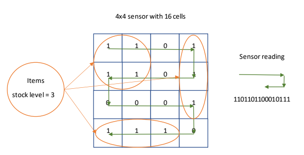

# Sensor Analyzer

## A wave function collapse approach to the shape recognition problem

### 1. Problem definition

We begin with a stream of binary sensor data where each bit represents a sensor's state (`0` is inactive and `1` is active).

This stream corresponds to a grid of sensors and is generated as follows:

Appart from that, we only expect three types of shapes (`3x1`, `1x3` and `2x2`) as shown in the figure.

Our goal is to identify the **number of shapes** detected by the sensors.

### 2. Assumptions

- **The grid is square**: this simplified some calculations. However, the code should be quite easy to adapt to non-square grids.
- **There may be no gaps between shapes**: In the example provided, the shapes are quite easy to identify, since there are no possible overlaps. However, it is assumed that this may not always be the case.
- **False positives exist**: It is also assumed that a sensor may fire (have a value of `1`) despite not being activated. Minimizing this is one of our figures of merit, since they are assumed to be quite uncommon.

### 3. The approach

Given the pattern-based nature of the problem, a _wave function collapse_ approach was chosen.

This means that, in every iteration:

1.  Each possible next shape is found
2.  For each of them, the _entropy_ is obtained
3.  The shape with least entropy is selected

The entropy is:

- ~~Higher the higher the number of possible shapes~~
- Lower the higher the number of false positives is.

This means that at every iteration the next shape chosen will minimize the number of false positives.
